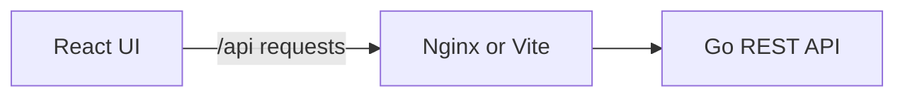

# Full-stack Calculator

## Setup

**The easiest way: Docker.** With Docker Desktop running, open a terminal in the
project root:

```sh
docker compose up --build
```

Open **[localhost:8081](http://localhost:8081)** and calculate. Go and Node are
provided by the build images, so you do not need to install them locally.

| Action | Command |
| --- | --- |
| Stop and remove containers | `docker compose down` |
| Run in the background | `docker compose up --build --detach` |
| View logs | `docker compose logs --follow` |
| Use another port | `APP_PORT=8082 docker compose up --build` |

For the attached command, press **Ctrl+C** before running `docker compose down`.
Rebuild and refresh the page after changing code.

## Local development

Prefer running without Docker? Install **Go 1.26+** and **Node 24.19+ (Node 24 LTS)**.
Node 25 is not supported. Use two terminals from the project root:

| Backend | Frontend |
| --- | --- |
| `cd backend` | `cd frontend` |
| `go run .` | `npm ci` |
| | `npm run dev` |

Open **[localhost:5173](http://localhost:5173)**. The API runs on port **8080**;
Vite forwards `/api` requests to it. Restart Go after backend changes.

To use another API port, run `PORT=8082 go run .` and set
`BACKEND_URL=http://127.0.0.1:8082` in `frontend/.env.local`, then restart Vite.

## API examples

All operations use **POST** with `Content-Type: application/json` and two numbers:

| Endpoint | Operation | Result for `left: 8, right: 2` |
| --- | --- | --- |
| `/api/add` | Addition | `10` |
| `/api/subtract` | Subtraction | `6` |
| `/api/multiply` | Multiplication | `16` |
| `/api/divide` | Division | `4` |

With Docker running:

```sh
curl http://localhost:8081/api/add \
  -H 'Content-Type: application/json' \
  -d '{"left":8,"right":2}'
```

```json
{"result":10}
```

Division by zero returns **400** with a readable JSON error:

```sh
curl -i http://localhost:8081/api/divide \
  -H 'Content-Type: application/json' \
  -d '{"left":8,"right":0}'
```

```json
{"error":{"code":"division_by_zero","message":"Cannot divide by zero."}}
```

For native development, use port **8080** in these examples. Requests must contain
exactly `left` and `right`, each once; the body limit is **1 KiB**. Invalid input and overflow
return 400. Unknown paths, wrong methods, excessive bodies, and incompatible
content types return 404, 405, 413, and 415 respectively, with JSON errors.

## Tests and builds

Run each command from the indicated directory:

| Directory | Tests | Build |
| --- | --- | --- |
| `backend/` | `go test ./...` | `go build -o bin/calculator .` |
| `frontend/` | `npm run test -- --run` | `npm run build` |

Backend checks: `go vet ./...` and `gofmt -l .` (formatting should print nothing).
Frontend builds include TypeScript checks. Both Docker builds also run tests.

Optional input fuzzing from `backend/`:
`go test ./internal/httpapi -run '^$' -fuzz=FuzzCalculationInput -fuzztime=20s -parallel=2`.

<details>
<summary><strong>Generate coverage reports</strong></summary>

From `backend/`:

```sh
go test -coverprofile=coverage.out ./...
go tool cover -func=coverage.out
go tool cover -html=coverage.out -o coverage.html
```

From `frontend/`:

```sh
npm run test:coverage
```

Open `backend/coverage.html` and `frontend/coverage/index.html` in a browser.
Reports are generated locally and excluded from Git. Coverage includes startup
files; it measures exercised code, not a guarantee of correctness.

</details>

## Design decisions



- **Arithmetic belongs to Go.** The UI collects input and displays API responses.
  Math functions, HTTP handlers, and server startup are separate. No database.
- **Small dependency footprint.** Go standard library; React state, plain CSS,
  and native `fetch`. Vitest and Testing Library cover frontend behavior.
- **Two operands, one operation.** Negatives, period decimals, and scientific
  notation are supported. Expressions and chained calculations are outside scope.
- **Limited numeric precision.** Go uses `float64`; the UI displays up to 12
  significant digits. `≈` and a note indicate display rounding or possible
  precision loss with large integers. This is not exact decimal arithmetic;
  absence of `≈` does not guarantee exactness. Very small values may underflow to zero.
- **Predictable failures.** The backend validates direct API callers. The UI
  disables controls during requests, waits up to 10 seconds, and allows manual
  retry. Go rejects zero divisors and non-finite operands/results.
- **One browser address.** Compose publishes only Nginx; the backend stays on
  the container network. API paths are preserved, so CORS configuration is unnecessary.

## Project layout

```text
backend/                  Go server, arithmetic, HTTP handlers, tests, Dockerfile
frontend/                 React UI, API client, tests, Nginx config, Dockerfile
compose.yaml              Starts both applications
AGENTS.md                 Architecture and development agreement
TASK.md / REQUISITES.md    Project scope and workflow
PROMPTS.md                Existing AI development notes
```
